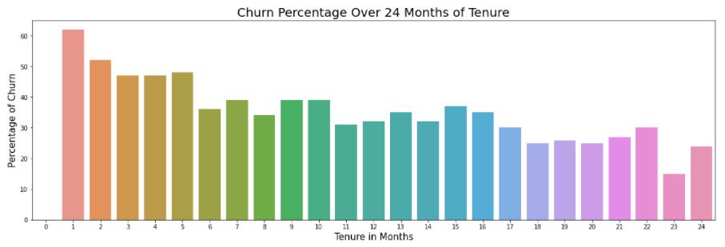

# Telecom-Customer-Churn
## Project Summary

#### Problem Statement
Develop a model for predicting customer churn at a fictitious wireless telecom company and use insights from the model to develop an incentive 
plan for enticing would-be churners to remain with company. There are 7043 customers in the database.

A key area where Data Science & Machine Learning Algorithms can help build a ML pipeline that would help predict which customer is more likely to churn so that the company/firm can take preventive measures or fix the problem.

#### Steps :
* Observing the data.
* Filling the missing values
* Encoding categorical variables
* Data Visualization
* Splitting the dataset
* Feature selection
* Model building
* Hypertuning the Parameters
* Selecting the model with the best performance

#### Graphs :

* The distribution of various services used by customers

Observation :

          1) In InternetService Fiber Obtics is the most preffered choice

          2) Phone Service is highely used service by the Customers

          3) Least used services are : OnlineSecurity & TechSupport

* Services having the highest churning customers

Observations : 

          1) Customers who are using StreamingMovies and StreamingTV are churning in higher proportions
          
* Impact of Tenure on Churn

Observations : 

          1) Shorter the tenure, higher is the possibility of Customer Churning
          2) Over 60 percent of customers who complete one month of tenure Churn. 
          3) As the length of tenure increases Churn reduces to about 25 percent at 24th month. 
          
* Impact of Contract on Customer Churn

Observations : 

          1) Customers with Month-to-Month contract are churning more, while two year contract customers are churning least
             
* Impact of PaymentMethod on Customer Churn

Observtions :

        1) Customers with Electronic Check as mode of payment are churning in higher proportion
  
Machine Learning Algorithm used to classify and then predict the outcomes :   

Churn being one of the biggest problem in the telecommunication industry it is definitely bad for the firm. Different methods need to be implemented in order to stop from customers to churn. As we saw from the above graphs there are multiple things that need to be changed / implemented. The best way to avoid customer churn is for a company to truly know the customer needs. Building customer loyalty through relevant experiences and specialized service is another strategy to reduce customer churn.
